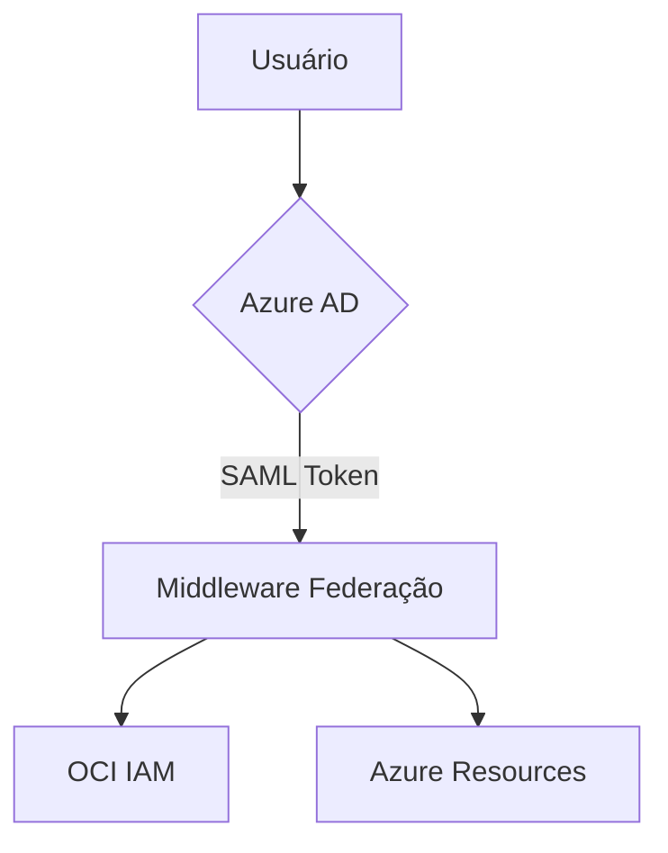

# Projeto de Federação de Identidades Multicloud

## 📘 Índice de Conteúdo
1. [Visão Arquitetural](#visão-arquitetural)
2. [Documentação de Implementação](#documentação-de-implementação)
3. [Componentes e Serviços](#componentes-e-serviços)
4. [Guia de Instalação e Configuração](#guia-de-instalação-e-configuração)

## 🌐 Visão Arquitetural

### Objetivo do Projeto
Implementar federação de identidades entre Microsoft Azure e Oracle Cloud Infrastructure (OCI) com Single Sign-On (SSO)

### Arquitetura de Alto Nível

#### Componentes Principais
- **Identity Provider**: Azure Active Directory
- **Service Providers**: 
  - Microsoft Azure
  - Oracle Cloud Infrastructure
  - Potencial extensão para AWS

#### Protocolo de Integração
- SAML 2.0 para autenticação federada
- Mapeamento de usuários e grupos
- Single Sign-On (SSO)

### Diagrama de Fluxo de Autenticação


### Serviços Envolvidos
- Azure AD Connect
- Identity Federation Service
- Multi-Factor Authentication
- Controle de Acesso Baseado em Grupos

## 📋 Documentação de Implementação

### Pré-requisitos

#### Credenciais Necessárias
- Conta administrativa Azure AD
- Conta administrativa OCI
- Permissões de configuração de identidade
- Certificados SSL válidos

#### Ferramentas Obrigatórias
- Azure AD Connect
- SAML Toolkit
- Powershell
- Terraform
- OpenSSL

### Etapas de Implementação

#### 1. Preparação do Ambiente
- Levantamento de inventário de usuários
- Mapeamento de grupos
- Geração de certificados

#### 2. Configuração de Provedor de Identidade
- Registro de aplicativo para federação
- Configuração de claims de usuário
- Definição de mapeamento de grupos

#### 3. Configuração OCI IAM
- Criação de provedor de identidade
- Configuração de metadados SAML
- Mapeamento de grupos

#### 4. Implementação de Single Sign-On
- Configuração de metadados
- Validação de federação
- Testes de autenticação

### Scripts de Suporte

#### Levantamento de Usuários (Powershell)
```powershell
Connect-AzureAD
Get-AzureADUser | Select-Object UserPrincipalName, DisplayName, Mail | Export-Csv -Path "usuarios_azure.csv"
```

#### Geração de Certificado (Bash)
```bash
openssl req -x509 -newkey rsa:2048 -keyout saml_key.pem -out saml_cert.pem -days 365 -nodes
```

### Configurações de Segurança

#### Políticas
- Habilitação de MFA
- Configuração de políticas de senha
- Revisão periódica de acessos

#### Monitoramento
- Logs centralizados
- Alertas de atividades suspeitas
- Rastreamento de acessos

## 🔐 Configurações Avançadas

### Terraform para Mapeamento de Grupos
```terraform
resource "oci_identity_group" "azure_mapped_group" {
  compartment_id = var.compartment_ocid
  name           = "AzureAdmins"
  description    = "Grupo mapeado do Azure AD"
}
```

### Métricas de Sucesso
- 100% de usuários migrados
- Tempo de autenticação < 500ms
- Zero interrupções de serviço
- Conformidade com políticas de segurança

## ⚠️ Desafios Potenciais
1. Latência de autenticação
2. Sincronização de grupos
3. Diferenças de políticas entre provedores

## 🔄 Plano de Contingência
- Manter credenciais antigas
- Documentar configurações originais
- Criar snapshots antes da migração

## 📊 Documentos Complementares
- Diagrama de arquitetura detalhado
- Planilha de mapeamento de grupos
- Registro de certificados
- Logs de migração

## 🚀 Próximos Passos
1. Validação com equipe de segurança
2. Teste piloto em grupo restrito
3. Treinamento de equipe
4. Migração completa
5. Monitoramento pós-implementação

### Informações de Contato
- **Responsável Técnico**: [NOME]
- **E-mail**: [EMAIL]
- **Data da Última Atualização**: [DATA]

## Histórico de Versões
- v1.0 - Documento inicial
- v1.1 - Ajustes de configuração
- v1.2 - Adição de scripts de suporte

**Nota**: Esta documentação é confidencial e de uso exclusivo da organização.
